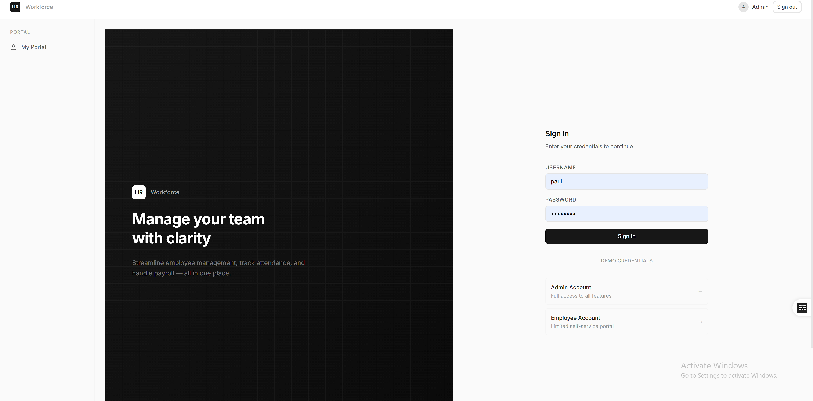
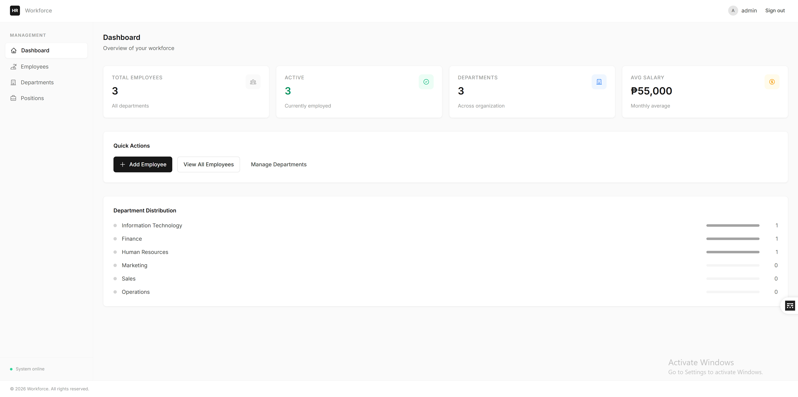

# 🏢 HR Management System

A full-stack Human Resource Management System built with **Vue.js**, **Node.js/Express**, and **MySQL**.

> ⚠️ **Work in Progress** - This project is under active development and not yet complete.

## 📸 Preview


### Login Page


### Admin Dashboard


---

## 🚀 Tech Stack

### Frontend
- **Vue 3** (Composition API)
- **Vue Router** - Client-side routing
- **Pinia** - State management
- **Tailwind CSS** - Utility-first styling
- **Axios** - HTTP client
- **Vite** - Build tool

### Backend
- **Node.js**
- **Express.js** - REST API framework
- **MySQL2** - Database driver
- **Express Validator** - Input validation
- **Morgan** - HTTP request logger

---

## ✅ Completed Features

### Module 1: Employee Lifecycle & Profile Management

- [x] Employee CRUD (Create, Read, Update, Delete/Archive)
- [x] Employee listing with pagination, search, and filtering
- [x] Department management
- [x] Position management
- [x] Admin dashboard with statistics
- [x] Login system (admin/employee roles)
- [x] Role-based access control
- [x] Employee self-service portal
- [x] Philippine-specific fields (SSS, PhilHealth, Pag-IBIG, TIN)
- [x] Emergency contact information
- [x] Bulk employee import (API ready)
- [x] Modern Linear/Notion-inspired UI
- [x] Responsive design

---

## 🚧 To-Do / Upcoming

### In Progress
- [ ] Password encryption (bcrypt)
- [ ] JWT token-based authentication
- [ ] Enhanced employee portal features
- [ ] File upload for employee documents
- [ ] Audit logging improvements

### Planned Modules
- [ ] **Module 2: Attendance & Time Tracking**
  - Time in/out logging
  - Shift management
  - Overtime tracking
  - Leave management

- [ ] **Module 3: Payroll Management**
  - Salary computation
  - Deductions and contributions
  - Payslip generation
  - 13th month pay computation
  - Government-mandated benefits

- [ ] **Module 4: Reports & Analytics**
  - Employee demographics
  - Attendance reports
  - Payroll summaries
  - Export to Excel/PDF

- [ ] **UI Enhancements**
  - Dark mode support
  - Charts and data visualization
  - Loading skeletons
  - Advanced animations

---

## 🛠️ Setup & Installation

### Prerequisites
- **Node.js** (v16 or higher)
- **MySQL** (v5.7 or higher) or **MariaDB** (v10+)
- **npm** or **yarn**

### 1. Clone the Repository
```bash
git clone https://github.com/P4blo0o0/Employee-Management.git
cd Employee-Management
